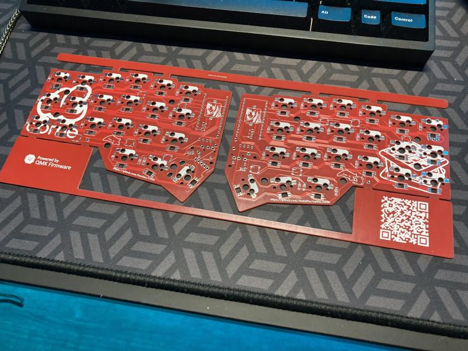

### proton-c compatible crkbd pcb

### info
#### required changes:
* Moving the TRRS data line to the TX pin (A9). 
* Moving the LED data line to a pin with a general purpose timer or similar (ADC3-12/B0).
* Pull-up resistors between VCC and Serial Data (~4.7k).
#### other changes:
* Added AST1109MLTRQ speaker footprints.
* Added two EC-11 rotary encoder positions. 
* Added Pimoroni Trackball support. Footprint reference: [MangoIV](https://github.com/MangoIV).

#### parts 
Item | Count 
------------ | -------------
[1N4148 Diodes (SOD-123)](https://lcsc.com/product-detail/Switching-Diode_LGE-1N4148W_C402213.html) | 42
[SK6812 Mini-E LEDs](https://www.aliexpress.com/item/4000475685852.html) | 42
[WS2812B LEDs](https://www.aliexpress.com/item/32732686773.html) | 12
[Kailh MX Sockets](https://www.aliexpress.com/item/4000019410050.html) | 42
[Proton-C](https://qmk.fm/proton-c/) or [Bonsai-C](https://github.com/customMK/Bonsai-C) | 2
[EC11 Rotary Encoders](https://www.digikey.com/en/products/detail/bourns-inc/PEC11R-4025F-S0024/4699199) | 2 
[PJ320A TRRS Jack](https://www.aliexpress.com/item/4000661212458.html) | 2
[Reset Switch](https://www.aliexpress.com/item/1255399892.html) | 2 
[4.7k Pullup Resistors](https://www.aliexpress.com/item/32979849787.html) (4K7 one) | 2
[AST1109MLTRQ Speakers](https://www.aliexpress.com/item/32558833519.html) | 2
[128x32 OLED Display](https://www.aliexpress.com/item/32794209149.html) | 2 
[MCU/OLED Sockets](https://www.aliexpress.com/item/32847384633.html) | 2 (40 pos. each, 48 needed)
[OLED Socket Pins](https://www.aliexpress.com/item/32855402975.html) | 1 (40 pos. each, 8 needed)
[MCU Millmax pins](https://www.digikey.com/en/products/detail/mill-max-manufacturing-corp/3320-0-00-15-00-00-03-0/4147392)   Alternatively, diode/resistor legs can be used | 48
Pimoroni Trackball [UK](https://shop.pimoroni.com/products/trackball-breakout) [EU](https://splitkb.com/collections/keyboard-parts/products/trackball-breakout) [NA](https://www.digikey.com/en/products/detail/pimoroni-ltd/PIM447/10246389) | 1
